# 阶段性总结：Git 的三层模型

学完 `git init`、`git status`、`git add`、`git commit`、`git log` 这一路下来，现在有足够的素材，可以正式把 Git 在本地的三个核心区域串起来看了。

对照图里的三层：

- **Working Directory / Working Tree**（工作目录）：当前目录里真实可见、可以直接编辑的文件，就是你在编辑器里看到的那些内容。
- **Staging Area / Index**（暂存区）：准备进入下一次 commit 的变化集合——你用 `git add` 主动挑进来的那部分。
- **Local Repository**（本地仓库）：已经通过 `git commit` 保存下来的、真正写进历史的那些快照。

对应到命令上：

- `git add` 把变化从 working directory 挪进 staging area。
- `git commit` 把 staging area 里的内容保存进 local repository。
- 反方向上，`git restore --staged`（或者 `reset`）能把变化从 staging area 退回 working directory；`checkout`/`reset` 能把 local repository 里的状态挪回 staging area——这两个命令我们还没正式学，图上先放着，后面讲到时回头对照。
- `git status` 是观察"文件现在在哪一层"的命令；`git log` 是观察 local repository 里 commit 历史的命令。

这套模型不需要死记成抽象定义，最好的办法是回头对着刚才 `foobar.txt` 的例子过一遍：一开始它是 untracked、待在 working directory 里；`git add` 之后挪进了 staging area；`git commit` 之后又进了 local repository，两次 commit 就是历史里的两张快照。把命令和这三层之间的搬运对应起来，比背图本身更有用。

下一步，我们接着看一个 `git status` 还没完全回答的问题：具体改了什么内容？这就是 `git diff`。
