# `git branch`

到这里为止，我们做的所有操作——`add`、`commit`、`diff`、`restore`、`reset`、`.gitignore`、`config`——其实都发生在同一条历史线上，一路直着往前走。从这一节开始，我们要认识 Git 真正的杀手锏：分支（branch）。有了分支，你才能一边保留能跑的主线，一边放心大胆地做实验、开发新功能，也才谈得上后面多人协作时"各自开工、互不干扰"。

## 先看看现在有哪些分支

```bash
git branch
```

```
* main
```

不带参数的 `git branch` 用来列出本地分支。这里只有一个 `main`，前面带的 `*` 表示"当前所在的分支"。

分支本质上就是一个指针（pointer），指向某一个 commit，仅此而已——不是复制了一份代码，只是一个"指向哪里"的标签。再往前一层还有个概念叫 `HEAD`，表示"你当前所在的位置"；通常情况下，`HEAD` 指向当前分支，当前分支再指向某个 commit，也就是一条链：`HEAD → 当前分支 → 某个 commit`。如果你现在在 `main` 上，产生了新的 commit，`main` 这个指针就会跟着往前挪，`HEAD` 还是指向 `main`，只是 `main` 指向的位置变了。

## 创建一个新分支

```bash
git branch experiment
git branch
```

```
  experiment
* main
```

讲解要点：

- `git branch experiment` 会基于当前 commit 创建一个新分支，就这一件事。
- 它**只创建，不切换**——`*` 还留在 `main` 上，这为下一节的 `git switch` 埋了个伏笔：创建分支和切换分支，是两个独立的动作。
- 此时 `main` 和 `experiment` 指向的是同一个 commit，还没有产生任何分叉。要等切换到 `experiment` 上并提交新内容之后，两条线才会真正分开。

用图来看会更直观——这也是这门课第一次需要画图的地方：



## 两个顺带一提的管理命令

```bash
git branch -m old-name new-name
git branch -d branch-name
```

这两个命令记一下用途就行，不需要现场对着真实分支名操作：

- `git branch -m old-name new-name` 用来重命名分支。如果你之前没配置好 `init.defaultBranch`，默认分支叫 `master`，理论上也能用这个改成 `main`。
- `git branch -d branch-name` 用来删除一个已经合并、不再需要的本地分支。

`git branch -D`（大写，强制删除，哪怕分支还没合并）先不展开，容易一不小心把还没合并的工作丢掉，等讲到 merge 的时候再回来说。远程分支相关的东西——`origin/main`、`git branch -r`、`git branch -a`——现在也先不提，等进入 Remote GitHub 部分、真正有了远程仓库的上下文，再讲才有意义。

下一步，我们要真正切换到 `experiment` 分支上，在上面提交一次新内容——这时候 `main` 和 `experiment` 才会第一次真正分叉，也就是 `git switch`。
