# `git switch`

上一节 `git branch experiment` 只是创建了分支，并没有切换过去。这一节的 `git switch` 才负责真正切换你当前所在的分支。

```bash
git switch experiment
git branch
git status
```

```
Switched to branch 'experiment'
* experiment
  main
On branch experiment
nothing to commit, working tree clean
```

讲解要点：

- `git switch experiment` 把当前分支切换到了 `experiment`——再运行 `git branch`，`*` 已经挪到了 `experiment` 前面。
- 从指针模型看，切换分支就是让 `HEAD` 指向另一个分支。
- 此时两个分支仍然指向同一个 commit，只是当前所在分支变了。

接着在 `experiment` 分支上做一次提交：

macOS + Windows Git Bash（Linux 可自行参考）:

```bash
echo "experiment idea" >> foobar.txt
git add foobar.txt
git commit -m "Try experiment idea"
git log --oneline
```

Windows PowerShell:

```powershell
Add-Content -Path foobar.txt -Value "experiment idea"
git add foobar.txt
git commit -m "Try experiment idea"
git log --oneline
```

```
[experiment 88bb60a] Try experiment idea
 1 file changed, 1 insertion(+)
88bb60a Try experiment idea
7a2290e Stop tracking local-only file
...
```

讲解要点：

- 当前在 `experiment` 分支上，所以新的 commit 会让 `experiment` 指针向前移动，`main` 仍然停留在原来的位置。
- 这就是分支的核心价值：可以在不影响主线的情况下做实验。
- 新的这个 commit 的父提交，就是 `main` 和 `experiment` 分开之前共同指向的那个 commit——`experiment` 是从那个位置长出来的一条新线。

用图看会更直观：



再切回 `main`，观察内容和历史的变化：

macOS + Windows Git Bash（Linux 可自行参考）:

```bash
git switch main
git branch
cat foobar.txt
git log --oneline
```

Windows PowerShell:

```powershell
git switch main
git branch
Get-Content -Path foobar.txt
git log --oneline
```

```
Switched to branch 'main'
  experiment
* main
hello git
second line
7a2290e Stop tracking local-only file
...
```

让自己观察三件事：`*` 回到了 `main`；`foobar.txt` 里刚才在 `experiment` 上新增的 `experiment idea` 消失了，因为当前 working directory 会跟随当前分支切换；`git log --oneline` 在 `main` 上看不到 `experiment` 的最新 commit，因为当前分支没有指向那条历史。

这时候第一次引入观察分支历史的命令：

```bash
git log --oneline --graph --all
```

`--graph` 在终端里显示历史结构，`--all` 显示所有分支，`--oneline` 让输出更紧凑。这条命令不需要马上背下来，但很适合用来观察分支是否分叉——上面那张图就是同一个状态的可视化版本。

`git switch -c feature-name` 值得记一下：它表示创建并切换到新分支，等价于先 `git branch feature-name` 再 `git switch feature-name`。这里先演示拆开的两个动作，理解了原理之后，`-c` 只是省一步而已。还有个小快捷方式 `git switch -`，效果类似命令行里的 `cd -`，能切回上一个所在分支，好用但不是主线重点。

切换分支前有个习惯要养成：最好先让 working directory 保持 clean，也就是先 `git status` 确认没有未处理的修改——否则 Git 可能阻止切换，或者切换后你会搞不清楚修改到底属于哪个分支。

下一步，我们要认识一个历史更久、职责更混合的命令——`git checkout`。
