# Merge conflict

`git merge` 之后，接着讲 merge conflict。真实工作里冲突经常发生在多人协作、`git pull`、Pull Request 里，但第一次学最好先在本地构造一个冲突——状态可控、命令少，能先看清楚冲突的本质，再往真实场景里推。

先说清楚一个观点：**merge conflict 不是 GitHub 独有的问题**。只要两条历史分支修改了同一个文件的同一段内容，Git 就无法自动判断该保留哪一边，于是产生冲突；remote、GitHub 只是让多人更容易产生分叉，真正检测和解决冲突的动作，仍然发生在 Git 合并历史的那一刻。

## 制造一个真实的冲突

先从 clean 的 `main` 开始，创建一个会产生冲突的分支：

```bash
git switch main
git switch -c conflict-a
printf "hello from conflict-a\nsecond line\nexperiment idea\n" > foobar.txt
git add foobar.txt
git commit -m "Update greeting on conflict branch"
```

```
Switched to a new branch 'conflict-a'
[conflict-a d1dfe92] Update greeting on conflict branch
 1 file changed, 1 insertion(+), 1 deletion(-)
```

然后回到 `main`，修改同一行，但改成另一个内容：

```bash
git switch main
printf "hello from main\nsecond line\nexperiment idea\n" > foobar.txt
git add foobar.txt
git commit -m "Update greeting on main"
```

```
Switched to branch 'main'
[main 73259b2] Update greeting on main
 1 file changed, 1 insertion(+), 1 deletion(-)
```

现在把 `conflict-a` 合入 `main`：

```bash
git merge conflict-a
git status
cat foobar.txt
```

```
Auto-merging foobar.txt
CONFLICT (content): Merge conflict in foobar.txt
Automatic merge failed; fix conflicts and then commit the result.
On branch main
You have unmerged paths.
  (fix conflicts and run "git commit")
  (use "git merge --abort" to abort the merge)

Unmerged paths:
  (use "git add <file>..." to mark resolution)
	both modified:   foobar.txt

no changes added to commit (use "git add" and/or "git commit -a")
<<<<<<< HEAD
hello from main
=======
hello from conflict-a
>>>>>>> conflict-a
second line
experiment idea
```

讲解要点：

- 这次 `main` 和 `conflict-a` 都修改了 `foobar.txt` 的第一行，Git 不知道该保留哪一边，所以暂停 merge，让人来决定。
- `git status` 显示当前有 unmerged paths，提示"both modified"。
- 文件里出现了 conflict markers：`<<<<<<<`、`=======`、`>>>>>>>`。

解释一下这几个 conflict markers：`<<<<<<< HEAD` 这一边表示当前分支（正在接收合并的 `main`）；`=======` 是两边内容的分隔线；`>>>>>>> conflict-a` 这一边表示被合并进来的分支。解决冲突不是删掉某一边这么简单，而是根据真实意图编辑成最终想要的内容。

顺带提一个能让冲突更容易看懂的配置：

```bash
git config --global merge.conflictstyle zdiff3
```

默认的冲突标记只显示"我这边"和"对方那边"两份内容；`zdiff3` 会额外显示两边分叉之前的共同祖先内容，格式类似（这里用我们这次冲突的实际内容举例，不是重新截的图）：

```plaintext
<<<<<<< HEAD
hello from main
||||||| base
hello git
=======
hello from conflict-a
>>>>>>> conflict-a
```

多出来的 `||||||| base` 段能帮助判断"这段内容原本是什么样，两边各自改成了什么"，对复杂冲突尤其有用。这是个人 Git 配置，属于效率优化，不是解决冲突必须掌握的内容，看时间决定是否现场演示。

## 解决冲突

把文件改成一个明确的最终版本：

```bash
printf "hello from main and conflict branch\nsecond line\nexperiment idea\n" > foobar.txt
git add foobar.txt
git status
git commit -m "Resolve greeting conflict"
git log --oneline --graph --all
```

```
On branch main
All conflicts fixed but you are still merging.
  (use "git commit" to conclude merge)

Changes to be committed:
	modified:   foobar.txt

[main 3934a3a] Resolve greeting conflict
*   3934a3a Resolve greeting conflict
|\
| * d1dfe92 Update greeting on conflict branch
* | 73259b2 Update greeting on main
|/
* ef3486c Try experiment idea
...
```

讲解要点：

- 解决冲突的步骤是：编辑文件、删除 conflict markers、保留最终想要的内容。
- `git add foobar.txt` 在这里的意思是告诉 Git：这个文件的冲突已经解决了。
- `git commit` 完成这次 merge——注意这次**真的**产生了一个 merge commit（`3934a3a`），`git log --graph` 上能清楚看到分叉再汇合的形状（`|\`、`| *`、`* |`、`|/`），这和上一节 fast-forward 的那条直线完全不同。

图示对照一下：



如果冲突中途搞乱了，还有个逃生命令：

```bash
git merge --abort
```

它会放弃这次 merge，尽量回到 merge 之前的状态。很实用，但真实项目里执行前要先确认没有其它重要修改混在工作区里。

这一节完全没有牵扯 remote。等后面讲到 GitHub Pull Request 或 `git pull` 时会回头说明：远程协作里的冲突，本质上还是这里学的 merge conflict，只是冲突的另一边来自远程仓库或别人的分支。

## 两个控制 merge 行为的参数

到这里已经见过两种 merge 结果：`experiment` 合并到 `main` 时是 fast-forward，没有额外 merge commit；`conflict-a` 合并到 `main` 时因为冲突，产生了一个真正的 merge commit。趁热再看两个能控制 merge 行为的参数。

先看 `--no-ff`：

```bash
git switch -c feature-note
echo "feature note" >> foobar.txt
git add foobar.txt
git commit -m "Add feature note"

git switch main
git merge --no-ff feature-note
git log --oneline --graph --all
```

```
Switched to a new branch 'feature-note'
[feature-note a0a7bdf] Add feature note
 1 file changed, 1 insertion(+)
Switched to branch 'main'
Merge made by the 'ort' strategy.
 foobar.txt | 1 +
 1 file changed, 1 insertion(+)
*   d35c20b Merge branch 'feature-note'
|\
| * a0a7bdf Add feature note
|/
*   3934a3a Resolve greeting conflict
...
```

讲解要点：

- 这次 `main` 没有新的 commit，本来会是 fast-forward，但 `--no-ff` 强制 Git 创建一个 merge commit（`Merge made by the 'ort' strategy.`），即使技术上可以直接快进。
- 好处是历史里能清楚看到"这里发生过一次分支合并"——`git log --graph` 上会有明显的分叉再汇合，而不是一条直线。
- 一些团队的分支策略会统一要求 `--no-ff`，方便回溯每个 feature 分支的边界。

再看 `--ff-only`：

```bash
git branch -d feature-note
git switch -c feature-two
echo "feature two" >> foobar.txt
git add foobar.txt
git commit -m "Add feature two"

git switch main
git merge --ff-only feature-two
git log --oneline --graph --all
```

```
Switched to a new branch 'feature-two'
[feature-two 2587819] Add feature two
 1 file changed, 1 insertion(+)
Switched to branch 'main'
Updating d35c20b..2587819
Fast-forward
 foobar.txt | 1 +
 1 file changed, 1 insertion(+)
* 2587819 Add feature two
*   d35c20b Merge branch 'feature-note'
...
```

讲解要点：

- `--ff-only` 表示"只允许 fast-forward，否则拒绝合并"。
- 如果 `main` 在这期间有新的、不在 `feature-two` 里的 commit，这条命令会直接失败，而不是自动创建 merge commit。
- 这适合希望保持线性历史、不想意外产生 merge commit 的场景，属于团队分支策略的一种选择，这里点到为止。

这两个参数不影响冲突本身的处理方式，只是决定"什么情况下产生 merge commit、以及是否允许 Git 自动决定"。

下一步，我们把本地这一路学到的东西收个尾——认识 Git aliases，顺便补上一个之前刻意没提的高频简写：`git commit -a`。
