# 阶段性总结：从本地三层模型到四区域模型

在正式进入 GitHub 之前，先回顾一次前面建立起来的本地三层模型：

- **Working Directory / Working Tree**：当前真实可编辑的文件。
- **Staging Area / Index**：准备进入下一次 commit 的变化。
- **Local Repository**：本地已经保存下来的 commit 历史。

然后引入第四个区域：**Remote Repository**（远程仓库）。

对应到命令上：

- `git add`：把 working directory 的变化放进 staging area。
- `git commit`：把 staging area 的内容保存进 local repository。
- `git restore` / `git reset`：用于撤销或移动本地不同区域里的状态——这些我们都已经亲手用过了。
- `git push`：把本地 commit 同步到 remote repository。
- `git fetch` / `git pull`：从 remote repository 获取别人或远程上的新变化。

这里要讲准确一件事：**remote 不等于 GitHub**。Remote repository 指的是另一个 Git 仓库地址，可以在 GitHub、GitLab、Gitea 这类平台上，也可以是公司内网服务器，甚至可以是本机上的一个 bare repository——这一点提一嘴就好，bare repo 不展开。

课堂接下来统一用 GitHub 作为 remote，因为它最常见，也能自然承接 issue、Pull Request、Actions、协作权限这些 GitHub 平台能力。

到这里，本地 Git 的部分正式收尾。下一步，我们要把这些本地的历史，第一次真正同步到网络上——认识 GitHub。
