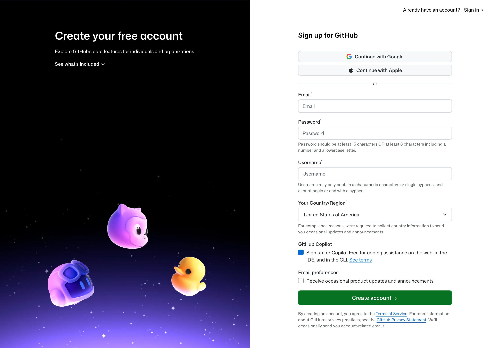

# Prerequisites 课前准备

Git 是开发者用来记录代码变化的版本控制工具。它可以帮你保存项目历史、查看每次修改、回到过去的版本，也能让多人协作时更清楚地知道谁改了什么。

GitHub 是一个基于 Git 的代码托管与协作平台。我们会用它把本地项目发布到网上，学习仓库、Issue、Pull Request、代码 review 和基础自动化这些真实开发中常见的协作方式。

这门课会从命令行开始学习 Git，再把本地仓库发布到 GitHub，并练习 Pull Request、Issue、GitHub CLI 和 GitHub Actions 的基础工作流。为了让课堂时间用在真正的练习上，请在上课前完成这份准备清单。

## 课前你需要准备好什么

上课前请确认你已经完成：

- [ ] 一个可以正常登录的 GitHub 账号。
- [ ] 本机已安装 Git。
- [ ] 本机有一个可用的终端工具；Windows 同学优先使用 Git Bash。
- [ ] 本机已安装 GitHub CLI，也就是 `gh` 命令。
- [ ] `gh` 已经登录你的 GitHub 账号。
- [ ] Git 已配置你的姓名、邮箱和默认分支名。
- [ ] 能通过最后的"课前自检"命令。

如果其中任何一步卡住，可以先问 AI/Google；如果解决不了，把报错截图或命令输出发给助教。

## 1. GitHub 账号

GitHub 是这门课使用的远程代码托管平台。请提前注册并确认可以登录：

- 注册入口：https://github.com/signup
- 登录入口：https://github.com/login
- 官方账号创建说明：https://docs.github.com/en/get-started/start-your-journey/creating-an-account-on-github

注册时请注意：

- 使用你课后还能访问的邮箱。GitHub 会要求验证邮箱，没有验证邮箱会影响创建仓库等基础功能。
- 不要把 GitHub 密码、验证码、recovery codes、personal access token 发给任何人，也不要粘贴到 AI 工具里。
- 用户名可以是英文、数字和短横线组合。课程里不要求用户名和真实姓名一致。



## 2. 安装 Git

Git 是这门课最核心的命令行工具。请从官方入口安装：

- Git 官方下载页：https://git-scm.com/install
- Windows: https://git-scm.com/install/windows
- macOS: https://git-scm.com/install/mac

安装建议：

- Windows 同学请使用 Git for Windows 官方安装包。安装完成后，你会同时得到 `git` 命令和 Git Bash；本课在 Windows 上默认推荐 Git Bash。
- macOS 同学可以用官方页面推荐的方式安装。如果你已经在使用 Homebrew，也可以用 `brew install git`。
- Linux 不作为本课单独设计的系统环境。如果你使用 Linux，通常可以参考 macOS + Git Bash 这一组命令，并自行处理发行版差异。
- 不需要为了这门课安装 Git GUI、复杂 diff 工具或额外图形客户端。课堂会优先使用命令行。

安装完成后，打开终端验证系统能找到 `git` 命令即可。

macOS + Windows Git Bash（Linux 可自行参考）:

```bash
command -v git
```

Windows PowerShell:

```powershell
Get-Command git
```

能看到 `git` 的安装路径就可以。路径每个人可能不同。

## 3. 准备终端工具

这门课会大量使用命令行。你不需要提前精通终端，但至少要能打开它、输入命令、复制输出。

推荐选择：

- Windows：优先使用 Git Bash。它会随 Git for Windows 一起安装，命令写法和 macOS 终端更接近，课堂上更容易统一。
- macOS：使用 Terminal 或你习惯的终端应用。

> Windows 注意：课程文档会按两组命令来写：`Windows PowerShell`，以及 `macOS + Windows Git Bash（Linux 可自行参考）`。课堂演示优先使用 Windows Git Bash / macOS 这一组；如果你更熟悉 PowerShell，也可以使用 PowerShell 版本。不要在同一步骤里频繁切换终端，因为不同终端的当前目录、路径写法和文本重定向行为可能不一样。

## 4. 安装 GitHub CLI

GitHub CLI 是 GitHub 官方命令行工具，命令名是 `gh`。这门课会用它登录 GitHub、创建或查看仓库、辅助处理认证问题。

- GitHub CLI 官网：https://cli.github.com/
- GitHub CLI 官方仓库与安装说明：https://github.com/cli/cli
- GitHub CLI manual：https://cli.github.com/manual/

安装建议：

- Windows 可以使用官网推荐的安装包或包管理器。
- macOS 可以使用官网推荐方式；如果你已经使用 Homebrew，也可以用 `brew install gh`。
- Linux 同学如果已经在自己的环境中学习开发，可参考 GitHub CLI 官方仓库说明自行安装；课堂不单独排查 Linux 包管理器差异。

安装完成后验证：

macOS + Windows Git Bash（Linux 可自行参考）:

```bash
gh --version
```

Windows PowerShell:

```powershell
gh --version
```

能看到 `gh version ...` 就说明安装成功。

## 5. 登录 GitHub CLI

安装 `gh` 之后，还需要把它和你的 GitHub 账号关联起来。请运行：

macOS + Windows Git Bash（Linux 可自行参考）:

```bash
gh auth login
```

Windows PowerShell:

```powershell
gh auth login
```

登录时建议选择：

- GitHub.com
- HTTPS
- Login with a web browser

按照终端提示复制一次性验证码，打开浏览器完成授权即可。

登录完成后，运行：

macOS + Windows Git Bash（Linux 可自行参考）:

```bash
gh auth status
```

Windows PowerShell:

```powershell
gh auth status
```

如果看到类似 `Logged in to github.com` 的信息，就说明登录成功。

如果后续 `git push` 时仍然要求用户名和密码，或提示认证失败，可以运行：

macOS + Windows Git Bash（Linux 可自行参考）:

```bash
gh auth setup-git
```

Windows PowerShell:

```powershell
gh auth setup-git
```

这个命令会让 Git 的 HTTPS 操作复用 `gh` 的登录状态。课堂上如果遇到认证问题，优先检查 `gh auth status` 和 `gh auth setup-git`，不要临时去网上生成 token。

> 安全提醒：不要把 personal access token、API key、密码、验证码粘贴到课堂群、共享文档或 AI 工具里。认证问题优先用 `gh auth login` 解决。

## 6. 配置 Git 基础身份

Git 每次创建 commit 时，都会记录作者信息。请提前设置你的姓名和邮箱：

macOS + Windows Git Bash（Linux 可自行参考）:

```bash
git config --global user.name "Your Name"
git config --global user.email "your-email@example.com"
git config --global init.defaultBranch main
```

Windows PowerShell:

```powershell
git config --global user.name "Your Name"
git config --global user.email "your-email@example.com"
git config --global init.defaultBranch main
```

请把 `"Your Name"` 和 `"your-email@example.com"` 换成你自己的信息。

这里的邮箱建议先使用你的 GitHub 账号已验证邮箱。隐私邮箱、no-reply 邮箱这些配置可以课后再单独了解，不影响完成本节课。

配置完成后检查：

macOS + Windows Git Bash（Linux 可自行参考）:

```bash
git config --global user.name
git config --global user.email
git config --global init.defaultBranch
```

Windows PowerShell:

```powershell
git config --global user.name
git config --global user.email
git config --global init.defaultBranch
```

其中 `init.defaultBranch` 应该输出：

```text
main
```

> 请注意，这里的 `name` 和 `email` 不一定和你 GitHub 账号的用户名、邮箱一致。Git 只会记录你在本机配置的姓名和邮箱。

## 7. 课堂前自检

上课前，请在终端运行下面这组命令。如果你愿意，可以把输出截图发给助教检查。

macOS + Windows Git Bash（Linux 可自行参考）:

```bash
command -v git
gh --version
gh auth status
git config --global user.name
git config --global user.email
git config --global init.defaultBranch
```

Windows PowerShell:

```powershell
Get-Command git
gh --version
gh auth status
git config --global user.name
git config --global user.email
git config --global init.defaultBranch
```

你应该确认：

- `command -v git` 或 `Get-Command git` 能找到 Git 安装路径。
- `gh --version` 能输出 GitHub CLI 版本。
- `gh auth status` 显示你已经登录 GitHub。
- `user.name` 不是空的。
- `user.email` 不是空的。
- `init.defaultBranch` 是 `main`。

如果这些检查都通过，课堂环境就基本准备好了。

## 8. 常见问题

### `git` 或 `gh` 提示 command not found

通常说明工具没有安装成功，或者安装目录没有加入系统 PATH。

处理顺序：

1. 关闭当前终端，重新打开再试一次。
2. 确认你是从官方入口安装的工具。
3. Windows 同学请优先打开 Git Bash 试试；如果 PowerShell 找不到 `git`，但 Git Bash 能找到，课堂上先用 Git Bash 即可。
4. 仍然失败时，把完整报错截图发给助教。

### Windows 上应该用 PowerShell 还是 Git Bash

课堂文档会给 `Windows PowerShell` 和 `macOS + Windows Git Bash（Linux 可自行参考）` 两组命令。Windows 默认推荐 Git Bash，因为它和 macOS 终端命令更接近，课堂演示更容易统一；如果你已经熟悉 PowerShell，也可以使用 PowerShell 版本。

不要在同一步骤里频繁切换终端，因为不同终端的当前目录和路径写法可能不一样。选一个能稳定运行的就好。

### GitHub 登录成功了，但 push 还是失败

先运行：

macOS + Windows Git Bash（Linux 可自行参考）:

```bash
gh auth status
gh auth setup-git
```

Windows PowerShell:

```powershell
gh auth status
gh auth setup-git
```

然后重新打开终端再试。不要把 GitHub 密码当作 Git push 的密码输入；GitHub 早已不支持这种方式。

### 配置错了姓名或邮箱怎么办

重新运行 `git config --global` 即可覆盖之前的配置：

macOS + Windows Git Bash（Linux 可自行参考）:

```bash
git config --global user.name "New Name"
git config --global user.email "new-email@example.com"
```

Windows PowerShell:

```powershell
git config --global user.name "New Name"
git config --global user.email "new-email@example.com"
```

如果你以前已经保存过 Git 历史记录，它们不会因为这次配置自动变化。课堂阶段不用紧张，先保证后续记录使用正确配置即可。

### 需要提前配置 SSH key 吗

不需要。SSH key 很有用，但会增加不少额外概念。为了降低课前准备成本，本课优先使用 HTTPS + GitHub CLI 登录。

后续如果你想长期维护自己的项目，可以再单独学习 SSH key。

### 需要提前学习 Git 命令吗

不需要。你只需要完成环境准备。课堂会从第一个 Git 仓库开始讲，不要求你提前掌握任何 Git 工作流。

如果你已经会一些 Git，也请先按课堂节奏来。我们会优先建立清晰的工作流，而不是一开始就追求复杂命令。
