> **写在前面**：这一节的命令输出是示意性的（用 `<your-username>` 这样的占位符），还没有真实抓取——需要一个独立于 `SingularityCoding` 的"学生账号"才能拿到真实的 fork/PR/merge 记录，等有了合适的第二个账号会补上真实截图/transcript。命令本身和真实的仓库名、issue 都是真的，跑起来会是真实效果，先照着做完全没问题。

# Issue + Fork + Pull Request：没有写权限时怎么贡献

上一节是在自己有写权限的仓库里协作。但在开源项目、或者课程公共仓库里，你通常对原仓库没有写权限，这时候的标准流程是：先有一个 issue 描述任务，然后 fork 仓库、在自己的 fork 里改，发 PR 请求合并回原仓库。

这里用一个课程专用的共享仓库 [`first-contributions`](https://github.com/SingularityCoding/first-contributions)，老师提前建好并保持是仓库 owner，内容很简单——`README.md` 和 `CONTRIBUTORS.md`。上课前，老师已经在这个仓库里建好了 [issue #1](https://github.com/SingularityCoding/first-contributions/issues/1)："Add your name to CONTRIBUTORS.md"，描述了任务：把自己的 GitHub username 加进 `CONTRIBUTORS.md`，通过 PR 提交，并在 PR 里写 `Closes #1` 关联这个 issue。

讲解要点：

- Issue 用来记录问题、需求、任务或讨论，不一定对应 bug，也可以是文档改进、功能建议、课程练习任务。
- 一个清楚的 issue 应该说明背景、期望结果、验收标准。
- Issue 是协作入口，PR 是解决这个 issue 的代码变更入口。
- 因为全班共用同一个 issue，第一个合并的 PR 会真正触发 GitHub 自动关闭这个 issue，其他同学的 PR 依然可以正常合并，只是不会再触发"关闭"这个动作——这是正常现象，不代表后面同学的贡献无效（issue 描述里也提前说明了这一点）。

## fork：在自己账号下复制一份

在 GitHub 网页上：打开 `first-contributions` 这个 repo → 点击 Fork → Owner 选择自己的账号 → 创建 fork。

- fork 是在自己 GitHub 账号下复制一份别人的仓库。
- 你对自己的 fork 有写权限，即使对老师的原仓库没有写权限。
- 通过 PR 请求把 fork 里的修改合回原仓库，这是没有写权限时贡献代码的标准方式。
- fork 是 GitHub 平台能力，不是 Git 的核心命令。

## clone 自己的 fork

```bash
git clone https://github.com/<your-username>/first-contributions.git
cd first-contributions
git status
git remote -v
git branch -vv
```

这是这门课第一次真正用到 `git clone`（`hello-github` 是本地 `init` 之后 push 上去的，不是 clone 来的）。`git clone` 做了几件事：从 remote repository 下载文件，也下载完整的 Git 历史，不只是当前快照；自动创建本地 `.git` 目录；自动添加一个名为 `origin` 的 remote，指向被 clone 的仓库——这里指向的是**你自己的 fork**，不是老师的原仓库；自动 checkout 默认分支（通常是 `main`），并建立本地 `main` 和远程 `origin/main` 的跟踪关系。

顺带认识一下查看 remote branch 的几种方式：

```bash
git branch
git branch -r
git branch -a
```

`git branch`（不带参数）只列出本地分支；`git branch -r` 列出 remote-tracking branches（比如 `origin/main`），它们是本地对远程分支状态的一份只读记录，会在 `fetch`/`pull`/`push` 时更新；`git branch -a` 同时列出本地分支和 remote-tracking branches。

## 加一个 `upstream`，指向老师的原仓库

```bash
git remote add upstream https://github.com/SingularityCoding/first-contributions.git
git remote -v
```



`origin` 是你自己的 fork，你有写权限；`upstream` 是老师的原仓库，通常只有读权限。这两个名字不是强制的，但是 GitHub 协作里的常见约定。

## 创建分支、修改、push 到自己的 fork

```bash
git switch -c add-<your-username>
printf '- <your-username>\n' >> CONTRIBUTORS.md
git status
git diff
git add CONTRIBUTORS.md
git commit -m "Add <your-username> to contributors"
git push -u origin add-<your-username>
```

## 创建 PR：从你的 fork 合到老师的原仓库

在 GitHub 上：打开你自己 fork 的页面，GitHub 通常会提示 Compare & pull request；base repository 选老师的原仓库，base branch 选 `main`；head repository 选你自己的 fork，compare branch 选 `add-<your-username>`；填写 PR title 和 description，description 里写上 `Closes #1`；创建 PR。

讲解要点：

- fork PR 的目标是"从我的 fork 分支合并到老师的原仓库 main"。
- `Closes #1` 会把这个 PR 和前面创建的 issue 关联起来；常见关键字还有 `Fixes #1`、`Resolves #1`，课堂用一个就够。
- PR 页面仍然可以 review、comment、run checks、merge。
- 老师 merge 后，你自己的 fork 不会自动同步，需要后续 fetch/pull upstream。

老师 review 并 merge PR 后，观察三件事：PR 显示 merged；如果是第一个合并的 PR，对应 issue 会自动关闭，后面同学的 PR 正常合并，issue 已经是关闭状态；`CONTRIBUTORS.md` 里出现了自己的名字。

## PR merge 后，同步一下自己的 fork

```bash
git switch main
git fetch upstream
git merge upstream/main
git push origin main
```

`git fetch upstream` 从老师的原仓库获取最新历史；`git merge upstream/main` 把老师原仓库的 `main` 合入你本地的 `main`；`git push origin main` 把同步后的本地 `main` 推回你自己的 fork。这一段对初学者略难，可以当作 fork 流程的收尾展示，不必要求一次完全掌握。

这一节建立的完整工作流是：

```plaintext
Issue 描述任务 -> 没有写权限 -> fork 到自己账号 -> clone 自己的 fork -> 建分支改动
-> push 到自己的 fork -> 给原仓库发 PR（Closes #1） -> review -> merge -> Issue 关闭 -> 同步 fork
```

这比上一节"自己仓库里走一遍"更接近真实的开源协作场景，也为后面 issue template 和 PR template 铺垫。

下一步，我们看看 GitHub 仓库里那些"特殊文件"——README、LICENSE、CONTRIBUTING、issue/PR template——都是干什么用的。
